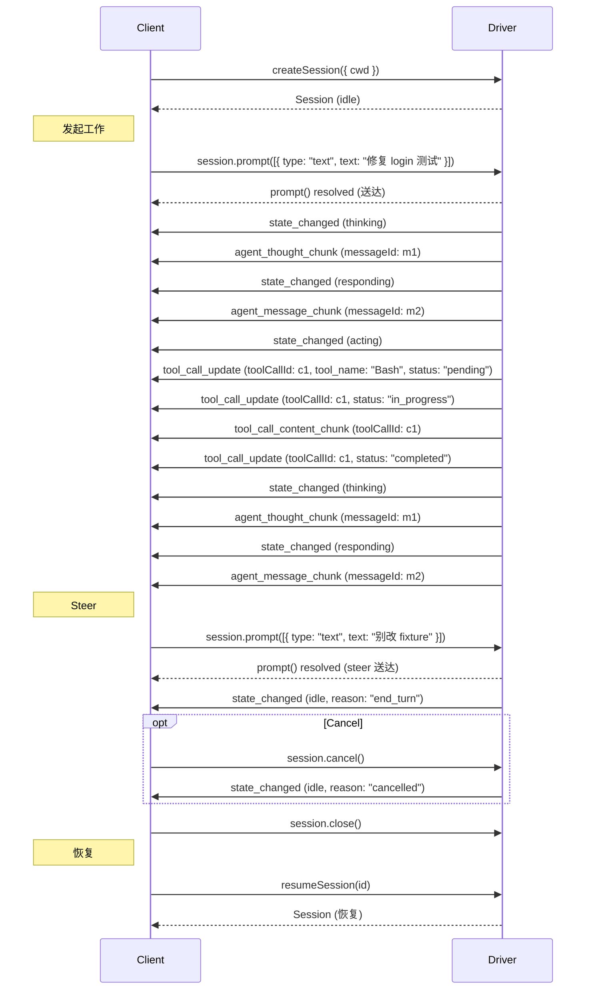

# AHAL — Agent Harness Access Layer

版本: 0.5 (草案)

AHAL 是 Agent Harness 的控制平面接口规范，以库的形式提供。上层应用（Client）链接 AHAL 库，通过统一接口控制各家的 agent harness（Codex、Claude Code、Kimi Code 等）；库内部由 Driver 组件完成具体 harness 的适配。

AHAL 不规定任何线上通信方式——Driver 与 harness 之间如何交互（子进程 + 原生协议、进程内 SDK 等）完全是实现细节。

---

## 设计原则

| 原则 | 说明 |
|------|------|
| **简洁** | 一个 Driver 接口 + 一个 Session 接口，覆盖 session 创建、prompt 发送、活动控制、事件流的全部需求 |
| **无能力协商** | 接口定义的语义即准入门槛，Driver 必须完整实现，无法满足的 harness 不接入 |
| **无权限往返** | 不做 mid-run 审批，所有 agent 以 yolo 模式运行（自动批准一切操作），安全性完全依赖运行环境 |
| **无 plan 模式** | plan 输出降级为普通事件透出，不建模状态 |
| **无 turn 概念** | steer 注入的消息与进行中的工作合并，不存在"请求-响应"边界；底层 harness 的 turn/run 概念是 Driver 内部实现细节 |

非目标：线上协议、跨进程标准、细粒度权限管理、agent 间通信。

---

## 架构

```
┌─────────────────┐
│  上层应用(Client) │
└────────┬────────┘
         │ AHAL 统一接口（本规范）
┌────────┴────────┐
│    AHAL 库       │
│  ┌───────────┐  │   任意方式      ┌──────────────┐
│  │ codex     │──┼── 子进程 ──────►│ codex        │
│  │ driver    │  │   app-server   │ app-server   │
│  ├───────────┤  │               ├──────────────┤
│  │ kimi      │──┼── 进程内 SDK ──►│ kimi-code    │
│  │ driver    │  │               │ SDK          │
│  └───────────┘  │               └──────────────┘
└─────────────────┘
```

- **Client**：链接 AHAL 库的上层应用（控制平面 UI、调度器、自动化脚本）
- **Driver**：适配一种 agent harness 的组件，实现本规范的全部接口与语义。Client 想控制多种 harness，就实例化多个 Driver
- **Harness 适配方式不做规定**：codex driver 可以 spawn `codex app-server` 讲 JSON-RPC，kimi driver 可以进程内调用 kimi-code SDK——只要向上交付本规范定义的语义

---

## 概念模型

AHAL 只有两个概念：

- **Session**：与某个 harness 的一段持续会话，有持久化历史，可关闭、可恢复
- **事件流**：Session 上发生的一切，按序投递给 Client

### 状态模型

Session 有四种状态。`thinking`、`responding`、`acting` 统称"忙"。

| 状态 | 含义 |
|------|------|
| `idle` | 空闲，无进行中的工作 |
| `thinking` | 模型推理中（reasoning / 思考输出阶段） |
| `responding` | 结果输出中（生成对用户可见的回复文本） |
| `acting` | 工具执行中 |

典型的工作区间是 `idle → thinking → (responding | acting → thinking)* → responding → idle`。

### 状态规则

- `prompt()` 在 `idle` 时启动新工作；在忙状态时注入（steer）进行中的工作
- 每次状态迁移发出一个 `state_changed` 事件（包括忙状态之间的来回切换）
- Driver **MUST** 精确区分三种忙状态（如实映射底层 harness 的推理、回复生成、工具执行阶段），不得笼统上报。底层协议无法提供此区分的 harness 不接入
- Compaction 不建模为状态：它是忙期间的一个插曲，由 `compaction_started` / `compaction_finished` 事件表达
- Session 自身的创建、重建、关闭不建模为状态：`createSession` resolve 即可用，`close()` 后调用任何方法 reject


## Driver

```typescript
interface Driver {
  readonly runtime: string;        // harness 标识,如 "codex" | "kimi" | "claude"
  readonly ahalVersion: number;    // 实现的 AHAL 规范版本

  createSession(options: SessionOptions): Promise<Session>;
  resumeSession(sessionId: SessionId): Promise<Session>;
}

interface SessionOptions {
  cwd: string;        // 工作目录,必选
  model?: string;     // 模型标识,缺省用 harness 默认
}
```

### createSession

创建 Session。Driver **MUST** 以 yolo 模式启动 agent（如 codex `--dangerously-bypass-approvals-and-sandbox`、kimi `--yolo`），并自动批准/屏蔽底层 harness 的一切审批请求，不向 Client 透出。

### resumeSession

恢复一个持久化的 Session（进程重启后）。Driver **MUST** 持久化 session 元数据与对话历史（依赖底层 harness 的持久化，如 `~/.codex/sessions`）；无法恢复时 reject `SessionNotFoundError`。

```typescript
import { createDriver } from "ahal";

const driver = createDriver("codex");
const session = await driver.createSession({ cwd: "/srv/app" });

// 进程重启后恢复
const same = await driver.resumeSession(session.id);
```

---

## Session

```typescript
interface Session {
  readonly id: SessionId;
  readonly cwd: string;

  prompt(input: Input): Promise<void>;
  cancel(): Promise<boolean>;

  readonly events: AsyncIterable<SessionEvent>;

  close(): Promise<void>;
}

type SessionState = "idle" | "thinking" | "responding" | "acting";
```

```typescript
type TextResource = {
  uri: string;          // 资源标识
  text: string;         // 文本内容
  mimeType?: string;    // MIME 类型
};

type BlobResource = {
  uri: string;          // 资源标识
  blob: string;         // base64 编码的二进制数据
  mimeType?: string;    // MIME 类型
};

type ContentBlock =
  | { type: "text"; text: string }
  | { type: "memory_resource"; data: string; mimeType: string }
  | { type: "embedded_resource"; resource: TextResource | BlobResource }
  | { type: "resource_link"; uri: string; name: string; mimeType?: string;
      title?: string; description?: string; size?: number }
```

**Text**

| 字段 | 类型 | 必选 | 说明 |
|------|------|------|------|
| `text` | `string` | 是 | 文本内容 |

**Memory Resource** — 内存中的数据，无 URI、无文件实体，由 `mimeType` 决定渲染方式。

| 字段 | 类型 | 必选 | 说明 |
|------|------|------|------|
| `data` | `string` | 是 | base64 编码的二进制数据 |
| `mimeType` | `string` | 是 | MIME 类型，如 `"image/png"`、`"audio/wav"` |

**Embedded Resource** — 有 URI 标识 + 内嵌内容。

| 字段 | 类型 | 必选 | 说明 |
|------|------|------|------|
| `resource` | `TextResource \| BlobResource` | 是 | 内嵌的资源内容，必须有 `uri` |

`TextResource` 和 `BlobResource` 字段见上方类型定义。

**Resource Link** — 资源引用，不携带内容，仅标识文件位置。

| 字段 | 类型 | 必选 | 说明 |
|------|------|------|------|
| `uri` | `string` | 是 | 资源 URI |
| `name` | `string` | 是 | 可读名称 |
| `mimeType` | `string` | 否 | MIME 类型 |
| `title` | `string` | 否 | 展示标题 |
| `description` | `string` | 否 | 内容描述 |
| `size` | `number` | 否 | 文件大小（字节） |

### prompt()

唯一的消息发送入口，自适应语义，resolve 即送达。

```typescript
type Input = ContentBlock[];

- Session `idle` → 启动新工作
- Session 忙（`thinking` / `responding` / `acting`）→ 作为 steer 注入进行中的工作

**不区分"启动"还是"注入"**——对 Client 而言只有"送达"与"未送达"（reject）。工作边界的归属是 Driver 内部事务。

**原子性。** 消息必然送达 agent（注入当前工作或作为新输入），不存在丢失或第三种去向。工作恰好在调用处理期间结束时，Driver **MUST** 将消息作为新输入启动工作。

**有序性。** 同一 Session 上连续调用的多条消息，按调用顺序送达 agent。

**Follow-up 语义。** 接口不提供队列。Client 若需要"等当前工作做完再做下一件"，应自行等待 `state_changed`（state 变为 `idle`）事件后再调用。

### cancel()

取消当前进行中的工作，返回是否确实有工作被取消（`idle` 时返回 `false`，不算错误）。

- 底层 harness 无协议层 interrupt 能力时，Driver **MUST** kill 底层进程并以原 session 上下文重建，对 Client 保持语义一致
- cancel 后事件流 **MUST** 继续投递尾部事件，直到发出 `state_changed`（`state: "idle"`，`reason: "cancelled"`）

### close()

关闭 Session，释放底层资源（子进程、连接等）。Session 的对话历史仍被持久化，之后可通过 `resumeSession` 恢复。

---

## 事件流

Session 的全部事件通过 `AsyncIterable<SessionEvent>` 按序投递。

```typescript
interface SessionEvent {
  event: Event;
}
```

### 消息

`agent_message` 和 `agent_thought` 使用 upsert 语义：首次出现时创建（`messageId` 在工作区间内唯一），后续同 ID 的 update 合并字段。Chunk 追加 ContentBlock。

```typescript
type Event =
  | { kind: "agent_message";        messageId: string; content?: ContentBlock[] }
  | { kind: "agent_message_chunk";  messageId: string; content: ContentBlock }
  | { kind: "agent_thought";        messageId: string; content?: ContentBlock[] }
  | { kind: "agent_thought_chunk";  messageId: string; content: ContentBlock }
```

Message 之间可交错——thinking 和回复的 chunk 可以交替发送，Client 按 `messageId` 分别拼接。

**Content 合并规则：**

- `agent_message` / `agent_thought` 不带 `content` → 保留已有输出不变
- 带 `content` → 整体替换（包括此前通过 chunk 累积的内容）
- 带 `content: []` 或 `content: null` → 清空
- `agent_message_chunk` / `agent_thought_chunk` → 追加一个 ContentBlock 到对应 messageId 的末尾


### 工具调用

`tool_call_update` 同样使用 upsert 语义：首次出现时创建（`tool_name` 必选），后续同 `toolCallId` 的 update 合并字段。`tool_call_content_chunk` 追加 ContentBlock。

```typescript
  | { kind: "tool_call_update";  toolCallId: string;
      tool_name?: string; title?: string;
      status?: "pending" | "in_progress" | "completed" | "failed" | "cancelled";
      content?: ContentBlock[] }
  | { kind: "tool_call_content_chunk"; toolCallId: string; content: ContentBlock }
```

| 字段 | 类型 | 说明 |
|------|------|------|
| `toolCallId` | `string` | 工具调用标识，工作区间内唯一 |
| `tool_name` | `string?` | 工具名（如 `"Bash"`、`"Read"`），首次出现时必选 |
| `title` | `string?` | 展示标题（如 `"安装依赖"`），可中途更新 |
| `status` | `string?` | 依次推进：`pending` → `in_progress` → 终态（`completed` \| `failed` \| `cancelled`） |
| `content` | `ContentBlock[]?` | 替换全部输出；省略保留；`[]`/`null` 清空 |

**Content 合并规则：** 与消息一致。

### 状态变更

每次状态迁移都发送——包括忙状态之间的来回切换。

```typescript
  | { kind: "state_changed"; state: SessionState;
      reason?: StopReason }
```

`reason` 仅在 state 变为 `idle` 时携带；忙状态之间切换的事件不携带。

**StopReason：**

| 值 | 含义 |
|----|------|
| `"end_turn"` | 正常结束，模型完成输出且未请求更多工具 |
| `"cancelled"` | 被 `cancel()` 取消 |
| `"max_tokens"` | 达到 token 上限 |
| `"max_turn_requests"` | 达到模型请求次数上限 |
| `"refusal"` | Agent 拒绝继续 |
| `"error"` | 异常终止，Driver **SHOULD** 在其前发送 `error` 事件说明原因 |

Driver **MUST** 保证：
- **每次迁移都发**，Client 以事件流为状态唯一来源
- 每段工作区间恰好以一个 `state_changed`（state 为 `idle`）收尾，即使工作因错误、cancel 或 Driver 内部异常终止
- `state_changed`（state 为 `idle`）恒为该区间的最后一个事件

### 用量

`usage_update` 是独立事件，不与状态迁移绑定，Agent **MAY** 随时发送。

```typescript
  | { kind: "usage_update"; context: number; context_window: number }
```

| 字段 | 类型 | 说明 |
|------|------|------|
| `context` | `number` | 上下文当前实际占用 token 数，compaction 后减小 |
| `context_window` | `number` | 模型上下文窗口上限 |

### 其他实体

```typescript
  | { kind: "subagent"; subagentId: string; status: string; description?: string }
  | { kind: "compaction_started" }
  | { kind: "compaction_finished" }
  | { kind: "error"; message: string; fatal: boolean }
  | { kind: "background_task"; taskId: string;
      status: "completed" | "failed"; description?: string; result?: string }
  | { kind: "notice"; message: string }
```

### 事件顺序与容忍

- 忙期间的事件严格有序
- `background_task` / `notice` 这类主动事件可在任意时刻出现（包括 idle 期间），Client 不得假设它们落在某个工作区间内
- Client **MUST** 容忍不认识的 `kind`（未来扩展），不得中断事件流消费
- `state_changed`（state 为 `idle`）之后 **MUST NOT** 再出现属于上一区间的 `agent_message*` / `agent_thought*` / `tool_call_*` 等事件；Driver 负责过滤这些滞留事件

---

## 生命周期



---

## 语义细则

### Cancel 竞态

`cancel()` 与工作自然结束存在竞态：cancel 调用时工作可能刚完成。

以 `state_changed`（state 为 `idle`）事件为唯一事实来源：无论谁先谁后，Client 只根据收到的 `reason` 判断结局。

### 瞬态窗口与 Steer 缓冲

底层 harness 可能存在短暂拒收 steer 的窗口（如 tool call 刚结束时）。Driver **MUST** 内部缓冲并在窗口关闭后重试，窗口期 **MUST** 有上限（建议 ≤ 5s）。这一切对 Client 不可见——`prompt()` 的 resolve 表示"Driver 已受理并保证送达"，不代表"此刻已注入"。

超时仍无法注入时，Driver **MUST** 保证消息不丢：作为新输入启动工作，并发送 `error` 事件（`fatal: false`）说明发生了降级。

### Follow-up 模式（客户端约定）

接口无队列。需要"做完 A 再做 B"的 Client：

```
session.prompt(A) → 等 state_changed(state=idle) 事件 → session.prompt(B)
```

### Client 崩溃与恢复

- Session 不随 Client 释放而销毁：只要底层 harness 的持久化还在，Client 重启后可 `resumeSession` 继续
- Driver 实例本身崩溃时，进行中的工作结局未知；Client **MUST** 在 `resumeSession` 后容忍"上一段工作没有收到 `state_changed`（state 为 `idle`）"的情况，直接开始新工作

---

## 错误类型

```typescript
class AhalError extends Error {}
class SessionNotFoundError extends AhalError {}      // resumeSession 的 session 不存在或无法恢复
class HarnessUnavailableError extends AhalError {}   // 底层 harness 不可用（未安装、版本不兼容）
class SessionBusyError extends AhalError {}          // session 正在重建中，暂时不可写
class InvalidInputError extends AhalError {}         // 输入非法或过大
```

其他语言的实现 **MUST** 提供可区分的等价错误类型。

---

## 完整示例

```typescript
import { createDriver } from "ahal";

const driver = createDriver("kimi");
const session = await driver.createSession({ cwd: "/srv/app" });

// 后台消费事件流
(async () => {
  for await (const { event } of session.events) {
    switch (event.kind) {
      case "agent_message_chunk":
        if (event.content.type === "text") {
          process.stdout.write(event.content.text);
        }
        break;
      case "agent_thought_chunk":
        // thinking 内容，通常折叠展示
        break;
      case "tool_call_update":
        if (event.status === "completed" || event.status === "failed") {
          console.log(`\n工具 ${event.tool_name}: ${event.status}`);
        }
        break;
      case "usage_update":
        console.log(`[usage] ctx ${event.context}/${event.context_window} tokens`);
        break;
      case "state_changed":
        if (event.state === "idle") {
          console.log(`\n工作结束: ${event.reason}`);
        } else {
          console.log(`[${event.state}]`);
        }
        break;
      case "background_task":
        console.log(`后台任务 ${event.taskId}: ${event.status}`);
        break;
    }
  }
})();

// 发起任务——resolve 即送达
await session.prompt([{ type: "text", text: "修复 login 的测试失败" }]);

// 进行中插话 → 自动成为 steer，接口上无差别
await session.prompt([{ type: "text", text: "别改 fixture，问题在源码" }]);

// follow-up：等 state_changed(state=idle) 事件后再发下一条
```
