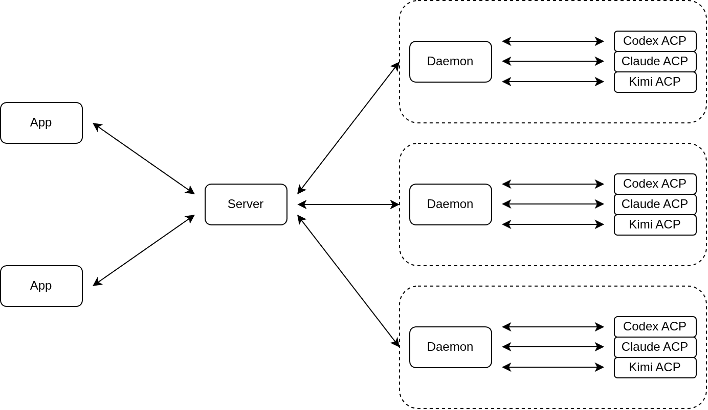

# 系统设计文档

**详略约定**：本文档只描述框架，不描述实现细节，实现细节交由实现 agent 决定。

## 总体架构

采用三级架构：Daemon 常驻在各个机器上，Server 常驻在公网服务器上，应用运行在客户端。Daemon 通过 stdio 与各 Agents 通信，Server 与各机器上的 Daemon 进程通过 WebSocket 通信，应用与 Server 进行 HTTPS 通信。



## 通信

### Server-Daemon 通信

Server-Daemon 通信采用 WebSocket，消息格式为 JSON-RPC 2.0。

#### 认证

在 Daemon 与 Server 建立 WebSocket 连接握手期间，Daemon 发送的握手请求需携带头部 `Authorization: Bearer <token>` 和 `amux-machine: <machine_name>`（URL 编码），Server 需要校验 token 是否正确，如不正确则握手失败，还需校验机器是否重名，若重名则握手失败。

#### 协议

| 方法 | 描述 |
|---|---|
| `machine.info` | 获取当前机器信息，包含操作系统、临时目录等 |
| `agent.list` | 发现当前机器已安装的 agents，以及每个 agent 是否启动 |
| `agent.restart` | 重启指定 agent |
| `git.diff` | 查询指定仓库改动 diff |
| `git.worktree.new` | 从指定仓库创建一个 worktree |
| `git.worktree.resume` | 从指定仓库指定路径恢复 worktree |
| `git.worktree.list` | 查询指定仓库所有 worktrees |
| `git.worktree.remove` | 删除指定 worktree |
| `fs.list` | 分页查看指定路径文件夹列表 |
| `fs.read` | 分页查看指定路径文本文件内容 |
| `terminal.open` | 打开一个终端，指定 cwd 和 size 等，返回终端 ID |
| `terminal.resize` | 调整指定终端窗口大小 |
| `terminal.input` |  向指定终端输入内容 |
| `terminal.close` |  关闭指定终端 |

Daemon 主动推送通知
| 通知 | 描述 |
|---|---|
| `acp` | ACP 消息转发 |
| `terminal.output` | 终端输出事件 |
| `terminal.exit` | 终端进程退出事件 |

Server 主动推送通知
| 通知 | 描述 |
|---|---|
| `acp` | ACP 消息转发 |

### Client-Server 通信

Client-Server 通信采用 HTTPS。

#### 认证

Client 向 Server 发送请求时，其头部必须携带 `Authorization: Bearer <token>`，Server 对每个 Client 数据请求都需要进行验证，Web 静态资源请求无需验证。

#### 协议

| 方法 | 描述 |
|---|---|
| GET `/machines` | 查询所有已连接机器，包含机器信息 |
| GET `/machines/<machine_name>/agents` | 查询当前机器的 agents，包含名称和可用性 |
| POST `/machines/<machine_name>/agents/rediscover` | 重新发现 agents |
| POST `/machines/<machine_name>/agents/<agent_name>/restart` | 重启指定 agent |
| GET `/machines/<machine_name>/list_dir` | 分页查看指定路径文件夹列表 |
| GET `/machines/<machine_name>/read_file` | 分页查看指定路径文本文件内容 |
| POST `/sessions` | 新建一个普通会话 |
| GET `/sessions` | 分页查询非关联普通会话列表，可指定项目 |
| GET `/sessions/<session_id>` | 查询指定普通会话 |
| POST `/sessions/<session_id>` | 往指定普通会话发送指令 |
| DELETE `/sessions/<session_id>` | 删除指定普通会话 |
| POST `/sessions/<session_id>/cancel` | 取消指定普通会话 |
| POST `/sessions/<session_id>/configure` | 配置指定普通会话：会话标题、会话选项、所属项目等 |
| GET `/sessions/<session_id>/config_options` | 获取指定普通会话的会话选项 |
| GET `/sessions/<session_id>/slash_commands` | 获取指定普通会话的斜杠命令 |
| GET `/sessions/<session_id>/plan` | 获取指定普通会话的 agent 计划 |
| GET `/sessions/<session_id>/context` | 获取指定普通会话的上下文信息 |
| GET `/sessions/<session_id>/history` | 分页查询指定普通会话的对话历史 |
| GET `/sessions/<session_id>/activities` | 分页查询指定普通会话的活动历史 |
| GET `/sessions/<session_id>/ongoing_activity` | 查询指定普通会话正在进行中的活动 |
| GET `/sessions/<session_id>/diff` | 查询普通会话工作目录改动 diff |
| POST `/sessions/<session_id>/terminals` | 打开指定普通会话一个终端 |
| GET `/sessions/<session_id>/terminals` | 查询指定普通会话所有打开的终端 |
| POST `/sessions/<session_id>/terminals/<terminal_id>` | 向指定终端输入内容 |
| GET `/sessions/<session_id>/terminals/<terminal_id>` | SSE 流式输出指定终端输出内容 |
| DELETE `/sessions/<session_id>/terminals/<terminal_id>` | 关闭指定终端 |
| POST `/sessions/<session_id>/terminals/<terminal_id>/resize` | 调整指定终端窗口大小 |
| POST `/workflows` | 新建一个工作流会话 |
| GET `/workflows` | 分页查询工作流会话列表，可指定项目，结果包含关联普通会话 |
| GET `/workflows/<workflow_id>` | 查询指定工作流会话 |
| POST `/workflows/<workflow_id>` | 往指定工作流会话发送指令 |
| DELETE `/workflows/<workflow_id>` | 删除指定工作流会话，级联删除关联普通会话 |
| POST `/workflows/<workflow_id>/configure` | 配置指定工作流会话：会话标题、所属项目等 |
| GET `/workflows/<workflow_id>/history` | 分页查询指定工作流会话的对话历史 |
| GET `/workflows/<workflow_id>/activities` | 分页查询指定工作流会话的活动历史 |
| GET `/workflows/<workflow_id>/ongoing_activity` | 查询指定工作流会话正在进行中的活动 |
| GET `/config/skills/` | 查询所有配置的技能 |
| PUT `/config/skills/` | 全量更新所有技能 |
| GET `/config/workflows/` | 查询所有配置的工作流计划 |
| PUT `/config/workflows/` | 全量更新所有工作流计划 |
| GET `/config/recent_workspaces/` | 查询所有配置的最近工作目录 |
| PUT `/config/recent_workspaces/` | 全量更新所有最近工作目录 |
| GET `/config/quick_commands/` | 查询所有配置的快捷指令 |
| PUT `/config/quick_commands/` | 全量更新所有快捷指令 |
| GET `/config/agent/` | 查询内置智能体配置 |
| PUT `/config/agent/` | 更新内置智能体配置 |
| GET `/config/projects/` | 查询所有配置的项目 |
| POST `/config/projects/` | 新建项目 |
| POST `/config/projects/order` | 更新项目顺序 |
| PUT `/config/projects/<project_name>` | 更新指定项目 |
| DELETE `/config/projects/<project_name>` | 删除指定项目 |

## Daemon

Daemon 常驻于每个机器上，主要负责 ACP 多路复用和执行与机器绑定的功能。

### 技术栈

- 基础库：`tokio` / `serde` / `serde_json`
- WebSocket：`tokio-tungstenite`
- Git：`gix`，gix 功能不足则用 git CLI
- PTY：`portable-pty`
- Nano 智能体：`rig` / `process-wrap`
- ACP：`agent-client-protocol` 官方 SDK
- CLI: `clap`

### Daemon 启动

Daemon 启动和关闭由用户手动执行，启动参数包括
- `--machine`：机器名称，不得有路径分隔符
- `--server`: Server 的 WebSocket 地址
- `--token`：认证 token

Daemon 启动时对 `~/.amux/daemon/<机器名>.lock` 锁文件加排他锁，加锁失败则打印日志并退出，持锁进程退出（含崩溃）时锁自动释放。

Daemon 关闭时，关闭所有已启动的 Agents。

### Agent 发现

| agent | 发现方式 |
|---|---|
| nano | 已内置 |
| codex | 本机装有 `codex` CLI 且 npx 可用 |

### Agent 启动

| agent | 启动方式 |
|---|---|
| nano | 进程内启动 |
| codex | `INITIAL_AGENT_MODE=agent-full-access npx -y @nyssance/codex-acp-v2` |

### Nano 智能体

Nano 智能体为 Daemon 内置智能体，运行在进程内，采用非流式传输请求模型 API，只有一个 shell 工具，所有数据存储在内存中。

系统提示词
```
你是 Nano，一名有用的电脑助手。
```

#### ACP 认证

1. initialize 响应里声明一个私有认证方法：
   ```json
     {
       "authMethods": [
         {
           "type": "_amux_config",
           "methodId": "amux-config",
           "name": "Amux 模型配置"
         }
       ]
     }
   ```
2. Server 初始化后立刻发 auth/login，模型配置放 _meta：
   ```json
     {
       "methodId": "amux-config",
       "_meta": {
         "amuxApiFormat": "responses",
         "amuxBaseUrl": "https://api.deepseek.com/v1",
         "amuxApiKey": "sk-xxx",
         "amuxModel": "deepseek-v4-flash",
         "amuxEffort": "high"
       }
     }
   ```
3. nano 收到后校验并生效；未登录（未收到配置）时 `session/new` 返回标准的 auth_required 错误
   
#### ACP 实现

- Initialization: 能力支持 `PromptCapabilities` / `SessionDeleteCapabilities`
- `session/resume`：在内存中恢复会话，若会话被删除，则新建会话
- `session/close` 和 `session/delete`：从内存中删除会话
- 不支持 agent 计划、斜杠命令、会话选项、Elicitation、MCP
- 发送 tool_call_update 时，其 title 为 shell 命令

### ACP 多路复用

Daemon 作为 Server 与 Agent 之间的桥梁进行消息转发，由于共享一个 WebSocket 连接，需要进行多路复用，转发的 ACP 消息格式如下
```json
{
  "jsonrpc": "2.0", 
  "method": "acp", 
  "params": {
    "agent": "xxx",
    "raw": "..."
  }
}
```

### 工作树存储

Git worktree 统一存储在 `~/.amux/worktrees/<仓库目录名>-<5字符随机串>/` 内。Git worktree 生命周期由 Server 进行管理。

### 终端存储

Daemon 在内存中仅存储终端元信息，终端输出由 Server 侧缓存。

### 断线重连

当无法与 Server 建立连接时，每隔 1 分钟主动重连一次。

当与 Server 连接断开后，在内存中缓存终端输出和 Agent 发出的消息，缓存设定上限，超过上限则丢弃最早的消息，待与 Server 重连后，将缓存消息发送给 Server。

## Server

### 技术栈

- 基础库：`tokio` / `serde` / `serde_json`
- HTTP & WebSocket: `axum`
- SQLite：`rusqlite`
- 工作流智能体：`rig`
- ACP：`agent-client-protocol` 官方 SDK
- CLI: `clap`

### Server 启动

Server 启动和关闭由用户手动执行，启动参数包括
- `--host`: 监听地址，默认为 `0.0.0.0`
- `--port`: 监听端口，默认为 `34567`
- `--token`：认证 token，必传
- `--web`：web 静态文件目录，未传则静态资源请求返回 404

Server 的 WebSocket 监听地址为 `ws://<host>:<port>/daemon`。

### Agent 生命周期

当 Daemon 与 Server 建立好连接后
1. Server 发送命令让 Daemon 发现机器上已安装的 agents
2. 如果 agent 未启动，则进行重新启动
3. 如果 agent 已启动但 Server 内无该 agent 活跃 ACP 连接记录，则关闭该 agent，进行重新启动
4. 如果 agent 已启动且 Server 内有该 agent 活跃 ACP 连接记录，则无需重新启动
5. 通过 Daemon 与重新启动的 Agent 建立 ACP 连接和初始化，针对 Nano 智能体还需额外认证流程

Server 可中途重启某一 Agent（无论是否已启动）。

### ACP 通信

Server 作为 ACP client 与 Agents 通信
- 采用 ACP V2 协议通信，不支持 V1 协议
- 权限自动审批
- Client 能力支持：空
- 惰性创建新会话：用户创建会话时，仅在 Server 侧写入，等待用户发送指令或查询会话选项时，才向 Agent 发送 `session/new` 请求创建 agent 侧会话
- 惰性恢复已有会话：等待用户往已有会话发送指令或查询会话选项时，才向 Agent 发送 `session/resume` 请求恢复 agent 侧已有会话
- 设置会话选项：用户可基于当前会话可选项进行会话设置，Server 向 Agent 发送 `session/set_config_option` 请求进行设置
- 主动关闭长时间无活动会话：当会话长时间无新活动（大于 1h）且会话状态为空闲时，向 Agent 发送 `session/close` 请求关闭 agent 侧会话，释放资源
- 取消会话：当用户取消会话时，向 Agent 发送 `session/cancel` 通知来取消会话执行
- 删除会话：当用户删除会话时，如果会话已打开，向 Agent 发送 `session/close` 请求关闭 agent 侧会话，如果 Agent 支持会话删除，则发送 `session/delete` 请求删除 agent 侧会话

### 普通会话状态

普通会话状态以 Server 端会话元数据存储为权威，任何状态变更需立即落盘。

普通会话状态变更
- 新建会话时，会话状态为空闲
- Server 重启后，其上所有普通会话状态应置为空闲
- Agent 重启后，其上所有普通会话状态置为空闲
- 当接收 `session/update` ACP 通知的 `state_update` 类型时
  - 若状态为 `running` 或 `requires_action` 则为工作中
  - 若状态为 `idle` 则为空闲

### 普通会话选项

普通会话选项存储在内存中，以 Agent 侧数据为权威
- 新建或恢复 ACP 会话时，存储其会话选项在内存中
- 当发送 `session/set_config_option` ACP 请求时，其响应中的会话选项全量覆盖内存存储
- 当接收 `session/update` ACP 通知的 `config_option_update` 类型时，其通知中的会话选项全量覆盖内存存储

### 普通会话斜杠命令

普通会话斜杠命令存储在内存中，以 Agent 侧数据为权威，当接收 `session/update` ACP 通知的 `available_commands_update` 类型时，其通知中的斜杠命令全量覆盖内存存储。

### 普通会话计划

普通会话计划存储在内存中，以 Agent 侧数据为权威，当接收 `session/update` ACP 通知的 `plan_update` 类型时，其通知中的计划全量覆盖内存存储。

### 普通会话上下文信息

普通会话上下文信息存储在内存中，以 Agent 侧数据为权威，当接收 `session/update` ACP 通知的 `usage_update` 类型时，其通知中的上下文窗口总大小和当前上下文大小全量覆盖内存存储。

### 普通会话删除

当用户请求删除普通会话时，立即从元数据中删除该普通会话，然后发起异步任务清理相关资源（如关闭或删除 agent 侧会话，清理关联的 worktree），随后立即返回响应。异步清理资源采用尽力而为的方式，不无限重试。

### 普通会话存储

普通会话数据包含三部分
- 元数据：存储在 `~/.amux/session.sqlite` 文件中
  ```SQL
  CREATE TABLE IF NOT EXISTS sessions (
    id TEXT PRIMARY KEY,             -- 会话 ID
    state TEXT NOT NULL,             -- 会话状态
    title TEXT,                      -- 会话标题
    project TEXT,                    -- 所属项目
    workspace TEXT NOT NULL,         -- 工作目录
    worktree_dir TEXT,               -- worktree 目录
    machine TEXT NOT NULL,           -- 所属机器
    agent TEXT NOT NULL,             -- 所属 Agent
    agent_session_id TEXT,           -- Agent 会话 ID
    created_at INTEGER NOT NULL,     -- 创建时间
    updated_at INTEGER NOT NULL      -- 更新时间
  );
  ```
- 对话历史：存储在 `~/.amux/session.sqlite` 文件中
  - Server 在往 Agent 发送 `session/prompt` 成功后，应立即给用户消息赋予消息 ID 并落盘，忽略 Agent 的 `session/update` 通知的 `user_message` 和 `user_message_chunk` 类别
  ```SQL
  CREATE TABLE IF NOT EXISTS messages (
    session_id TEXT NOT NULL,      -- Amux 普通会话 ID
    message_id TEXT NOT NULL,      -- 消息 ID：用户消息 ID 由 Amux 生成，Agent 消息 ID 由 Agent 提供
    role TEXT NOT NULL,            -- user / agent
    content TEXT NOT NULL,         -- 消息内容，以 json 格式存放
    created_at INTEGER NOT NULL,   -- 创建时间
    updated_at INTEGER NOT NULL,   -- 更新时间
    PRIMARY KEY (session_id, message_id)
  );
  ```
- 活动历史：存储在 `~/.amux/session.sqlite` 文件中
  ```
  CREATE TABLE IF NOT EXISTS activities (
    session_id TEXT NOT NULL,      -- Amux 普通会话 ID
    activity_id TEXT NOT NULL,     -- toolCallId / thought message id / 本地生成的唯一 ID
    kind TEXT NOT NULL,            -- 类别：tool_call / thinking / error
    content TEXT,                  -- 活动内容，以 json 格式存放
    created_at INTEGER NOT NULL,   -- 创建时间
    updated_at INTEGER NOT NULL,   -- 更新时间
    PRIMARY KEY (session_id, activity_id)
  );
  ```

Server 在接收到流式内容后，应按 ACP V2 流式传输的 upsert 语义立即落盘。

### 终端存储

Server 缓存终端输出在内存中，有最大值上限，超限丢弃旧的输出。终端跟普通会话绑定，每个普通会话可以有多个终端。普通会话删除时，需要删除对应终端。

当终端超过 1 天没有任何输入和输出时，自动删除该终端。

### 工作树管理

普通会话创建时若指定了 worktree 方式，则创建 worktree，普通会话被删除时，其关联的 worktree 也应一并删除。

当普通会话超过 7 天不活跃时，自动清理其关联的 worktree，但不要清理其会话的 worktree 相关元数据，后续可按需（如用户向该会话输入新指令、查看会话工作目录）在同一目录重建 worktree。

### 工作流智能体

系统提示词
```
你是 amux 的工作流智能体。你的职责是：传达信息、按照工作流计划进行调度。

行为规范：
1. 传达信息：把用户指令、工作流结论和关联普通会话内容完整如实传递，不增删、不改写、不代入自己的解读、不补建议、不总结你的主张。
2. 不做任务拆解、任务执行、任务决策：你可以调用工具创建/配置/下发会话，但不得替用户或普通会话决定怎么做、做到什么程度。
3. 只执行计划中明确写出的条件分支：不得创造计划之外的步骤，不得自主变更目标。
4. 未在计划与用户指令中指定的事项交由用户决定；需要人类判断时，输出结论并停下等待用户指令，不得擅自继续。

工作流计划：
{plan}
```

| 工具 | 用途 |
|---|---|
| `list_agents` | 已连接机器及各机器的 agent 列表 |
| `list_sessions` | 本工作流的关联普通会话列表，会话包含会话ID、状态等尽可能多的信息 |
| `create_session` | 创建关联普通会话 |
| `prompt_session` | 向指定关联普通会话下发指令 |
| `cancel_session` | 取消指定关联普通会话进行中的工作 |
| `configure_session` | 配置指定关联普通会话：会话标题，会话选项等 |
| `get_session_config_options` | 获取指定关联普通会话的会话选项 |
| `read_session_history` | 分页读取关联普通会话对话内容 |
| `read_session_activities` | 分页读取关联普通会话活动内容 |

工作流智能体实现应支持 steer，当工作流会话处于工作中时，接收的用户消息以 steer 方式注入。

工作流智能体采用非流式方式请求模型 API。

模型上下文
- 对话首次启动从磁盘上 `<workflow_id>_transcript.jsonl` 文件中进行恢复（为每个工具调用自动补一条工具结果：`[工具结果已过期]`）
- 对话运行时，在内存中维护对话并即时落盘（transcript 始终不包含工具结果），内存中保留最近 5 轮对话内的工具结果真实值，更早轮次的均替换为 `[工具结果已过期]`
- 不做其他额外上下文压缩

### 工作流会话驱动

当收到关联普通会话的 其他状态->`idle` 且 `stopReason` != `cancelled` 的 ACP 的 `session/update` 通知的 `state_update` 类型时，系统往工作流会话以用户消息方式注入如下内容

> 关联普通会话 `<session_id>@<机器名称>` 检测到状态变更：<旧状态> -> <新状态>，变更原因为 <变更原因>

### 工作流会话状态

工作流会话状态以 Server 端会话元数据存储为权威，任何状态变更需立即落盘。

工作流会话状态变更
- 新建会话时，会话状态为空闲
- Server 重启后，其上所有工作流会话状态应置为空闲
- 当工作流智能体开始运行时，将状态置为工作中
- 当工作流智能体结束运行时，重新计算工作流会话状态
- 当接收关联普通会话的 `session/update` ACP 通知的 `state_update` 类型时，重新计算工作流会话状态

### 工作流会话存储

工作流会话数据包含如下部分
- 元数据：存储在 `~/.amux/workflow.sqlite` 文件中
  ```SQL
  CREATE TABLE IF NOT EXISTS workflows (
    id TEXT PRIMARY KEY,              -- 工作流会话 ID
    title TEXT,                       -- 会话标题
    state TEXT NOT NULL,              -- 会话状态
    plan TEXT NOT NULL,               -- 执行计划
    project TEXT,                     -- 所属项目
    created_at INTEGER NOT NULL,      -- 创建时间
    updated_at INTEGER NOT NULL       -- 更新时间
  );

  CREATE TABLE IF NOT EXISTS workflow_linked_sessions (
    workflow_id TEXT NOT NULL,         -- 工作流会话 ID
    session_id TEXT NOT NULL,          -- 关联普通会话 ID
    PRIMARY KEY (workflow_id, session_id)
  );
  ```
- 对话和活动历史：存储在 `~/.amux/workflows/<workflow_id>_transcript.jsonl` 文件中，包含用户输入、工作流智能体输出、工具调用、thinking、执行错误，不包含工具结果
  ```json
  {"kind": "user", "content": [ ... ], "timestamp": 1725800000000}
  {"kind": "agent", "content": [ ... ], "timestamp": 1725800001000}
  {"kind": "thinking", "timestamp": 1694230800000, "thinking": "先查看目录结构…"}
  {"kind": "tool_call", "timestamp": 1694230805000, "tool_call_id": "call_001", "tool_name": "read_file", "parameters": "..."}
  {"kind": "error", "timestamp": 1694230810000, "error": "模型 API 调用失败：xxx"}
  ```

### 工作流计划存储

存储在 `~/.amux/config/workflows.json` 路径，格式为
```json
[
  {
    "name": "amux开发工作流",
    "plan": "xxx",
    "lastUsedProject": "project1"
  }
]
```
注意 name 必须唯一。读写为低频操作，无需考虑并发和原子写入问题。

### 技能存储

存储在 `~/.amux/config/skills.json` 路径，格式为
```json
[{ "name": "opencli", "description": "位于 https://github.com/jackwener/OpenCLI/tree/main/skills，包含多个 skills" }]
```
注意 name 必须唯一。读写为低频操作，无需考虑并发和原子写入问题。

### 最近工作目录存储

存储在 `~/.amux/config/recent_workspaces.json` 路径，格式为
```json
[
  {
    "machine": "localpc",
    "workspace": "/home/linwei/workspace/amux",
    "lastUsedProject": "project1",
    "lastUsed": 1729000000000
  }
]
```
注意 (machine, workspace) 组合必须唯一。读写为低频操作，无需考虑并发和原子写入问题。

### 快捷指令存储

存储在 `~/.amux/config/quick_commands.json` 路径，格式为
```json
[
  {
    "project": "project1",
    "name": "Commit & Push",
    "prompt": "提交并推送当前工作区的更改：为改动写一条简洁的 commit message，commit 后 push。"
  }
]
```
注意 (project, name) 必须唯一。读写为低频操作，无需考虑并发和原子写入问题。

### 内置智能体配置存储

存储在 `~/.amux/config/agent.json` 路径，格式为
```json
{
  "apiFormat": "responses",
  "baseUrl": "https://api.deepseek.com/v1",
  "apiKey": "sk-xxx",
  "model": "deepseek-v4-flash",
  "effort": "high"
}
```
读写为低频操作，无需考虑并发和原子写入问题。

### 项目存储

存储在 `~/.amux/config/projects.json` 路径，格式为
```json
[
  {
    "name": "项目 A",
    "description": "xxx"
  }
]
```
注意 name 必须唯一。读写为低频操作，无需考虑并发和原子写入问题。

## 应用

### 新建会话视图

打开新建会话视图时，实时拉取机器、agents、最近作目录和工作流计划，不定时刷新。

当在工作目录输入框输入时，实时拉取全部目录项（不包括文件）进行前缀匹配
- 在输入目录边界处，如 `/`、`/home/` 和 `/home/tom/`，触发拉取该目录的全部目录项
- 在后续目录输入时，如 `/ho` 和 `/home/t`，展示前缀匹配项

### 会话列表视图

会话列表刷新机制
- 定时刷新：每隔 10s 刷新一次会话列表
- 主动刷新：当创建新会话、删除会话、重命名会话、用户或系统往会话发送用户消息时，主动触发会话列表刷新

会话列表滚动机制：按滚动位置计算应展示的页并拉取，预取上下相邻两页缓冲。页大小随面板可视高度自适应调整。

### 会话交互视图

会话对话消息刷新机制为
- 交互视图未打开时，不主动刷新，打开后才进行刷新
- 会话打开后立即刷新一次
- 定时刷新：每隔 5s 刷新一次，如有新增或修改对话消息，增量渲染
- 主动刷新：当用户输入消息后，主动触发刷新

其他刷新机制
- 实时活动在视图打开时获取一次，然后每隔 2s 刷新一次
- 快捷指令、会话选项和斜杠命令在视图打开时获取一次，不定时刷新

对话滚动机制：按滚动位置计算应展示的页并拉取，预取上下相邻两页缓冲。页大小随面板可视高度自适应调整。

### 活动视图

会话的活动视图未打开时，不主动刷新。打开后，立即刷新一次，然后采用定时刷新机制，每隔 10s 刷新一次，如有新增或修改活动，增量渲染。

活动列表滚动机制：按滚动位置计算应展示的页并拉取，预取上下相邻两页缓冲。页大小随面板可视高度自适应调整。

### 计划视图

会话的计划视图未打开时，不主动刷新。打开后，立即刷新一次，然后采用定时刷新机制，每隔 10s 刷新一次。

### 终端视图

终端视图未打开时，不主动拉取终端输出内容。终端视图打开时，通过 HTTP SSE 技术增量获取终端输出内容。

终端每次打开时，从 Server 获取一次终端列表，不在列表中的终端从应用中移除掉，终端列表不做周期性轮询刷新。

### 工作目录视图

实时拉取每一级目录项，不进行任何缓存，也不定时刷新。

### 改动审查视图

改动审查视图未打开时，不主动拉取改动内容。视图打开时，刷新一次，不定时刷新。

### 会话详情视图

会话详情视图未打开时，不主动拉取详情。视图打开时，刷新一次，不定时刷新。

### 设置页面

设置项均在打开时实时获取，不进行定时刷新。

### 技能操作

当用户安装、更新或卸载技能时，由应用侧发起对应 agent 的普通会话，工作目录指定系统临时目录，并发送指令到普通会话
```
以下是技能 <skill_name> 的描述，请安装/更新/卸载此技能
> <skill_description>
```

### 共享主题

主题存放在项目内 `theme.json` 文件中，只有一套主题，用于在不同应用间共享颜色/间距/圆角/字号等信息。

### 桌面应用

#### 技术栈

- GUI：`gpui` + `gpui-component`
- HTTP: `reqwest`
- 终端：`alacritty_terminal`

#### 连接存储

Server 连接信息存储在 `~/.amux/app/server.json` 中，格式为
```json
{
  "server": "https://amux.example.com:34567",
  "token": "xxx"
}
```

### Web 应用

Web 应用需适配桌面和手机浏览器。

#### 技术栈

- UI：`react` + `typescript`
- 组件库：`shadcn/ui`
- 终端：`xterm.js`

#### 连接存储

Server 连接 token 存储在浏览器 localStorage 中。

## 可观测性

Daemon、Server 和应用在实现时，均需埋点丰富的日志。日志按天切片，存储最近 7 天的日志。

日志级别默认为 info，依赖库日志级别默认为 warn，支持通过 RUST_LOG 环境变量调整。

日志库采用 `logforth`。

日志存储
- Daemon：存放在 `~/.amux/logs/daemon.log`
- Server：存放在 `~/.amux/logs/server.log`
- 桌面应用：存放在 `~/.amux/logs/desktop.log`
- Web 应用：无需日志